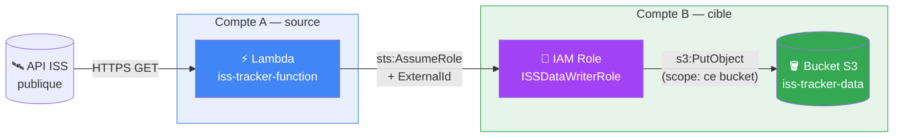
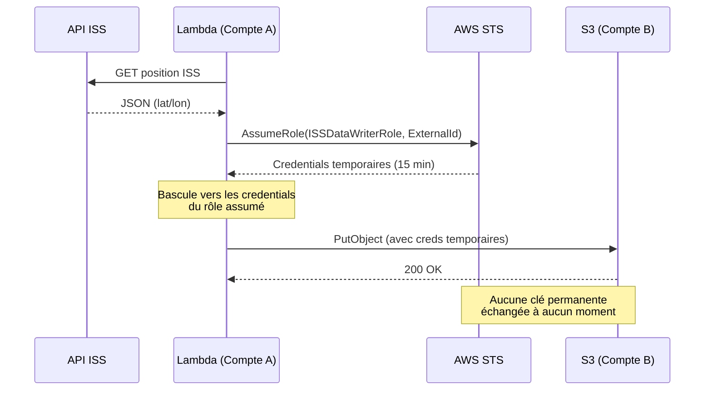
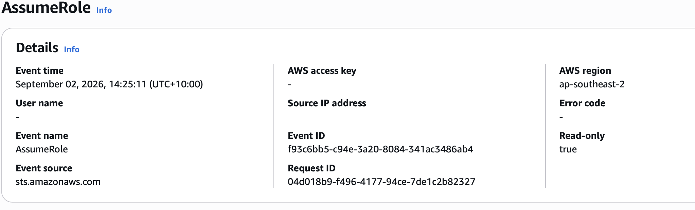

# AWS Cross-Account Access via STS — ISS Tracker

> Comment donner à un service AWS l'accès à des ressources dans un autre compte — sans jamais partager de clé d'accès permanente.

## Table des matières

- [Architecture](#architecture)
- [Le flux détaillé](#le-flux-détaillé)
- [Pourquoi ce projet](#pourquoi-ce-projet)
- [Comment ça marche](#comment-ça-marche)
- [Déploiement](#déploiement)
- [Résultat obtenu](#résultat-obtenu)
- [Ce que j'ai appris](#ce-que-jai-appris)
- [Sources](#sources)

## Architecture

## Le flux détaillé

Ce diagramme de séquence montre l'ordre exact des appels et — point clé — le moment où les credentials changent :

## Pourquoi ce projet

| | 🔴 Clés permanentes (à éviter) | 🟢 STS AssumeRole (ce projet) |
|---|---|---|
| **Durée de vie** | Illimitée jusqu'à révocation manuelle | 15 minutes, expiration automatique |
| **Exposition en cas de fuite** | Accès total et durable | Fenêtre d'exploitation très courte |
| **Traçabilité** | Difficile à distinguer par session | Chaque session a un `RoleSessionName` unique, visible dans CloudTrail |
| **Portée des droits** | Souvent trop large | Scopée précisément par la permissions policy |

## Comment ça marche

Le rôle cible (`ISSDataWriterRole`, Compte B) repose sur deux politiques indépendantes :

| Politique | Répond à la question | Contenu |
|---|---|---|
| **Trust policy** | Qui a le droit d'endosser ce rôle ? | Seul le Compte A, et seulement avec le bon `ExternalId` (protection contre le "confused deputy problem") |
| **Permissions policy** | Que peut faire ce rôle une fois endossé ? | Uniquement `s3:PutObject` sur un bucket précis — rien d'autre |

Côté Compte A, la Lambda dispose d'une permission `sts:AssumeRole` scopée à l'ARN exact du rôle cible.

## Déploiement

Prérequis : deux comptes AWS distincts.

1. **Compte B** — créer le bucket S3, puis le rôle IAM avec les policies fournies dans [`policies/`](policies/) :
   - `trust_policy_accountB.json`
   - `permissions_policy_accountB.json`
2. **Compte A** — créer le rôle d'exécution Lambda avec `lambda_execution_policy_accountA.json`.
3. Déployer [`src/lambda_function.py`](src/lambda_function.py) avec les variables d'environnement `TARGET_ROLE_ARN`, `BUCKET_NAME`, `EXTERNAL_ID`.
4. Tester dans la console Lambda.

Remplacez `<ACCOUNT_A_ID>` et `<ACCOUNT_B_ID>` par vos propres Account ID.

## Résultat obtenu

<table>
<tr>
<td width="50%">

**Objet écrit dans S3 (Compte B)**

</td>
<td width="50%">

**AssumeRole dans CloudTrail (audit)**

</td>
</tr>
</table>

## Ce que j'ai appris

- La différence entre une politique de confiance (accès au rôle) et une politique de permissions (capacités du rôle), et pourquoi les deux sont nécessaires indépendamment.
- Le rôle de `ExternalId` dans la prévention du "confused deputy problem" lors d'un accès cross-compte.
- Pourquoi des credentials temporaires réduisent la surface d'attaque, même en cas de compromission du code applicatif.
- Le débogage de politiques IAM à partir de messages d'erreur `AccessDenied`.

## Sources

- [AWS IAM — Tutorial: Delegate access across AWS accounts using IAM roles](https://docs.aws.amazon.com/IAM/latest/UserGuide/tutorial_cross-account-with-roles.html)
- [AWS IAM — Cross account resource access](https://docs.aws.amazon.com/IAM/latest/UserGuide/access_policies-cross-account-resource-access.html)
- [AWS Security Blog — How to use trust policies with IAM roles](https://aws.amazon.com/blogs/security/how-to-use-trust-policies-with-iam-roles/)
- [Where the ISS at? — API documentation](https://wheretheiss.at/w/developer)

---

Projet réalisé dans le cadre d'un apprentissage pratique en cloud security. [LinkedIn](#)
