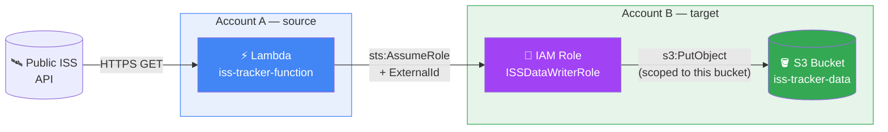
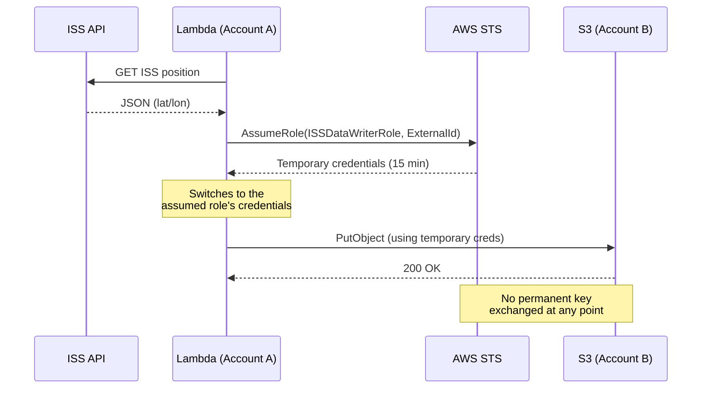
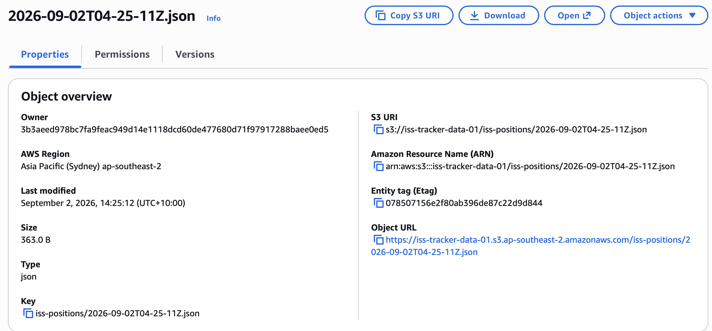

# AWS Cross-Account Access via STS — ISS Tracker

> How to give an AWS service access to resources in another account  without ever sharing a permanent access key.

## Table of Contents

- [Architecture](#architecture)
- [The Detailed Flow](#the-detailed-flow)
- [Why This Project](#why-this-project)
- [How It Works](#how-it-works)
- [Deployment](#deployment)
- [Result](#result)
- [What I Learned](#what-i-learned)
- [Sources](#sources)

## Architecture

## The Detailed Flow

This sequence diagram shows the exact order of calls and — the key point — the moment the credentials change:

## Why This Project

| | 🔴 Permanent keys (to avoid) | 🟢 STS AssumeRole (this project) |
|---|---|---|
| **Lifetime** | Unlimited until manually revoked | 15 minutes, automatic expiration |
| **Exposure if leaked** | Full and lasting access | Very short exploitation window |
| **Traceability** | Hard to distinguish per session | Each session has a unique `RoleSessionName`, visible in CloudTrail |
| **Scope of access** | Often too broad | Precisely scoped by the permissions policy |

## How It Works

The target role (`ISSDataWriterRole`, Account B) relies on two independent policies:

| Policy | Answers the question | Content |
|---|---|---|
| **Trust policy** | Who is allowed to assume this role? | Only Account A, and only with the correct `ExternalId` (protection against the "confused deputy problem") |
| **Permissions policy** | What can this role do once assumed? | Only `s3:PutObject` on one specific bucket — nothing else |

On the Account A side, the Lambda has an `sts:AssumeRole` permission scoped to the exact ARN of the target role.

## Deployment

Prerequisites: two separate AWS accounts.

1. **Account B** — create the S3 bucket, then the IAM role using the policies provided in [`policies/`](policies/):
   - `trust_policy_accountB.json`
   - `permissions_policy_accountB.json`
2. **Account A** — create the Lambda execution role with `lambda_execution_policy_accountA.json`.
3. Deploy [`src/lambda_function.py`](src/lambda_function.py) with the environment variables `TARGET_ROLE_ARN`, `BUCKET_NAME`, `EXTERNAL_ID`.
4. Test it from the Lambda console.

Replace `<ACCOUNT_A_ID>` and `<ACCOUNT_B_ID>` with your own account IDs.

## Result

<table>
<tr>
<td width="50%">

**Object written to S3 (Account B)**

</td>
<td width="50%">

**AssumeRole event in CloudTrail (audit trail)**

</td>
</tr>
</table>

The ARN `assumed-role/ISSDataWriterRole/iss-tracker-lambda` confirms the call genuinely came from this project's Lambda function.

## What I Learned

- The difference between a trust policy (access to the role) and a permissions policy (capabilities of the role), and why both are required independently of each other.
- The role of the `ExternalId` condition in preventing the "confused deputy problem" during cross-account access.
- Why temporary credentials reduce the attack surface, even if the application code itself is compromised.
- Debugging IAM policies from `AccessDenied` error messages.

## Sources

- [AWS IAM — Tutorial: Delegate access across AWS accounts using IAM roles](https://docs.aws.amazon.com/IAM/latest/UserGuide/tutorial_cross-account-with-roles.html)
- [AWS IAM — Cross account resource access](https://docs.aws.amazon.com/IAM/latest/UserGuide/access_policies-cross-account-resource-access.html)
- [AWS Security Blog — How to use trust policies with IAM roles](https://aws.amazon.com/blogs/security/how-to-use-trust-policies-with-iam-roles/)
- [Where the ISS at? — API documentation](https://wheretheiss.at/w/developer)

---

Project built as part of hands-on cloud security learning. [LinkedIn](#)
